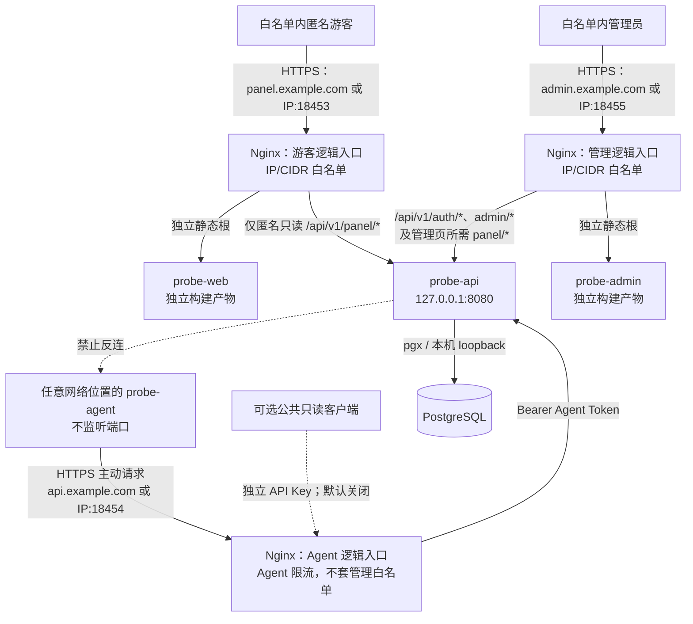
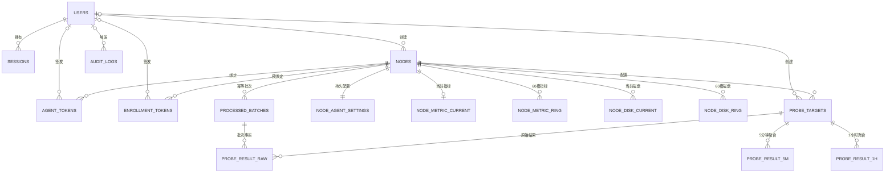

# 架构与三产品部署边界

状态：2026-08-25 产品拆分修订。与历史 `v1.1` 全量 Release 或本文旧段落冲突时，以本节的三产品独立安装规则为准。

适用范围：`probe-agent/`、`probe-api/`、`probe-web/`、`probe-admin/` 及各自的发行、安装和运行配置。

## 1. 架构决策

### 1.1 对外产品边界

源码工程与对外安装产品不是同一个划分维度。对外固定为三个产品：

| 产品 | 包含源码工程 | 不包含 | 当前顺序 |
| --- | --- | --- | ---: |
| 管理端 | 分别构建的 `probe-admin`、`probe-api`，以及迁移、Setup、PostgreSQL/Nginx 配置 | `probe-web`、`probe-agent` 和 Agent 下载目录 | 1 |
| Agent | `probe-agent` 及其独立安装资产 | 任一前端、API 服务端和数据库 | 2 |
| 访客前端 | `probe-web` 静态产物及只读 API 接入配置 | 管理 SPA、API 服务端、Agent | 3 |

三者各有独立 Release、安装器、升级、回滚、卸载和验收。管理 SPA 与 API 配套交付不改变其源码和构建边界：API 仍不嵌入 SPA。

固定实施顺序是：先安装管理端并创建管理员；再在管理界面创建节点、保存 Agent 采集参数；然后在目标服务器安装独立 Agent；最后才按需安装访客前端。管理端未配置全局 Agent 入口时，Agent 路由、Token 和安装命令失败关闭。

管理端首次安装只建立一个管理入口：域名模式使用一个管理域名，IP 模式只使用 `18455`。历史游客 `18453`、Agent `18454` 和三域名不是管理端安装的前置条件。当前管理 IP 模式允许与配置有效的既有 Nginx 共存；管理域名模式仍使用独占 ACME，不能宣称与 active Nginx 共存。

### 1.2 最终运行时组成

三个产品都按需安装并完成显式接入后，最终运行态由六个独立部分组成：

- `probe-agent`：Go 编写的 Linux 探针，只主动拉取配置和上报数据。
- `probe-api`：Go `net/http` API，负责认证、授权、数据写入、查询、聚合、清理和审计。
- `probe-web`：Vue/Vite 游客面板，仅通过游客逻辑入口（域名模式 `panel.example.com`，IP 模式 `IP:18453`）的同源只读 API 访问后端。
- `probe-admin`：Vue/Vite 管理面板，仅通过管理逻辑入口（域名模式 `admin.example.com`，IP 模式 `IP:18455`）的同源认证、管理和所需只读 API 访问后端。
- PostgreSQL：唯一持久化数据库。
- Nginx：唯一公网入口，负责 TLS、管理入口 IP/CIDR 白名单、反向代理、静态文件和基础限流。

两个浏览器入口都固定为同源模式且互不共享静态产物。下图和后续三入口说明描述的是三个产品全部接入后的目标运行态，不表示一个安装包会同时创建这些入口。各产品必须只增加自己拥有的入口和资产。

最终目标可选择三个公信 HTTPS Host，或使用同一规范 IP 上彼此独立的端口：游客 18453、Agent 18454、管理 18455。后续 Agent、访客产品的入口细节必须在各自阶段单独冻结和验收，不能依赖旧全量安装器自动补齐。

匿名游客通过游客入口只获得 `probe-web` 和 `/api/v1/panel/*`；管理员通过管理入口只获得 `probe-admin`、`/api/v1/auth/*`、`/api/v1/admin/*` 以及管理页面所需的只读 `/api/v1/panel/*`。两者都必须通过同一严格 IP/CIDR 白名单；游客匿名不代表公网开放。Agent 入口只暴露 Agent API、固定下载资产和默认关闭的可选 public API。任一前端都不跨入口调用其他逻辑入口。



图中的“禁止反连”表示禁止的方向，不是一条可用链路。

## 2. 仓库目录边界

仓库只共享版本管理和顶层设计文档，四套代码必须放在独立目录：

```text
mianban/
├── probe-agent/              # Agent 源码与独立 Go 模块
│   ├── cmd/probe-agent/
│   ├── internal/
│   ├── deploy/systemd/
│   ├── go.mod
│   └── go.sum
├── probe-api/                # 管理后端和全部 Go API
│   ├── cmd/probe-api/
│   ├── internal/
│   ├── migrations/
│   ├── api/openapi.yaml
│   ├── deploy/
│   ├── go.mod
│   └── go.sum
├── probe-web/                # 用户确认的独立前端面板
│   ├── src/
│   ├── public/
│   ├── package.json
│   └── package-lock.json
├── probe-admin/              # 独立管理员前端
│   ├── src/
│   ├── public/
│   ├── package.json
│   └── package-lock.json
├── docs/design/              # 阶段 0 冻结设计
├── jiyi.md
├── jihua.md
└── biandong.md
```

边界规则：

1. 四个工程各自拥有入口、依赖清单、测试、构建命令、部署配置和构建产物。
2. `probe-api` 不使用 `embed` 或其他方式打包 `probe-web` 或 `probe-admin`；Nginx 分别服务两套静态文件和代理 API。
3. `probe-web` 与 `probe-admin` 不相互导入、不导入 Go 源码、不连接 PostgreSQL，只依赖冻结的 HTTP/OpenAPI 契约。
4. `probe-agent` 不依赖 `probe-api`、`probe-web` 或 `probe-admin` 的实现代码；共享概念通过协议文档表达，不通过跨目录源码引用表达。
5. 迁移文件、OpenAPI 和 API 部署配置归 `probe-api/`；Agent 的 systemd 单元归 `probe-agent/`；游客和管理前端各自维护静态部署元数据。每个产品只安装自己拥有的 Nginx 片段；管理端阶段不得提前创建游客/Agent 入口或占位目录。
6. 本地真实系统只保存源码和必要文档；依赖安装、测试、构建、运行及部署只在 Debian 13 虚拟机进行。

## 3. 运行时与允许的依赖方向

| 发起方 | 目标 | 允许的协议 | 是否允许 | 说明 |
|---|---|---|---:|---|
| 游客浏览器 | 游客入口：`panel.example.com` 或 `IP:18453` | HTTPS | 是 | 必须先通过 Nginx IP/CIDR 白名单，只加载 `probe-web` |
| `probe-web` | 同源 `/api/v1/panel/*` | HTTPS JSON | 是 | 白名单内匿名只读，无游客账号或 Session |
| `probe-web` | `/api/v1/auth/*`、`/api/v1/admin/*` | 任意 | 否 | panel Host 不暴露，返回 `404` |
| 管理员浏览器 | 管理入口：`admin.example.com` 或 `IP:18455` | HTTPS | 是 | 必须先通过 Nginx IP/CIDR 白名单，只加载 `probe-admin` |
| `probe-admin` | 同源 `/api/v1/auth/*`、`/api/v1/admin/*` | HTTPS JSON | 是 | Session、`admin` 角色和写请求 CSRF 由 API 校验 |
| `probe-admin` | 同源 `/api/v1/panel/*` | HTTPS JSON | 是 | 仅复用管理页面所需的只读面板数据 |
| `probe-web`、`probe-admin` | PostgreSQL | 任意 | 否 | 前端不能访问数据库 |
| Agent | Agent 入口的 `/api/v1/agent/*` | HTTPS JSON，可 gzip | 是 | 域名模式为 `api.example.com`，IP 模式为 `IP:18454`；Agent 主动发起，Bearer Agent Token |
| 目标机管理员 | Agent 入口的 `/downloads/probe-agent/*` | HTTPS GET/HEAD | 是 | 只下载发布时固定的公开首次安装资产，不携带节点令牌；IP 模式另有固定公开 `ca.pem` |
| API/Nginx | Agent | 任意入站连接 | 否 | 服务端不得反连 Agent |
| API | PostgreSQL | pgx/PostgreSQL | 是 | V1 仅本机 loopback；`5432` 不允许监听内网或公网地址 |
| 公网 | API `:8080` | HTTP | 否 | API 固定只监听 `127.0.0.1:8080` |
| 公网 | PostgreSQL `:5432` | PostgreSQL | 否 | 不对公网开放 |
| 公网 | Agent | 任意入站连接 | 否 | Agent 不监听任何端口 |

## 4. Nginx 入口与路由边界

下列三节表达三个产品全部接入后的逻辑入口，不是管理端安装器的输出清单。管理端当前只创建管理逻辑入口；Agent 和游客入口由各自后续安装/接入流程创建。域名最终态可分别映射到 `panel.example.com`、`admin.example.com`、`api.example.com`；IP 最终态可分别映射到同一 IP 的 TCP 18453、18455、18454。IP 模式中 Cookie 不按端口隔离，因此后续游客和 Agent 入口还必须清空上游 `Cookie` 并隐藏 `Set-Cookie`。

### 游客逻辑入口（`panel.example.com` 或 `IP:18453`）

- `/*`：白名单通过后只提供 `/srv/probe/web` 中的 `probe-web` 构建产物及其 SPA fallback。
- `/api/v1/panel/*`：白名单通过后匿名只读，不要求账号、密码或 Session。
- `/api/v1/auth/*`、`/api/v1/admin/*`、`/api/v1/agent/*`、`/api/v1/public/*`、`/internal/*`：不暴露，返回 `404`。
- `/login`、`/login/*`、`/admin`、`/admin/*`：在 SPA fallback 前返回 `404`，避免把管理端浏览器路由伪装成游客页面。
- `/downloads`、`/downloads/*`：在 SPA fallback 前返回 `404`，Agent 安装文件不能从游客入口取得。

### 管理逻辑入口（`admin.example.com` 或 `IP:18455`）

- `/*`：白名单通过后只提供 `/srv/probe/admin` 中的 `probe-admin` 构建产物及其 SPA fallback。
- `/api/v1/auth/*`、`/api/v1/admin/*`：白名单通过后同源反代到 API；登录和管理身份仅限管理员。
- `/api/v1/panel/*`：可为管理页面同源提供所需只读数据，不改变 `/admin/*` 的 Session/CSRF 边界。
- `/api/v1/agent/*`、`/api/v1/public/*`、`/internal/*`：不暴露，返回 `404`。
- `/overview`、`/overview/*`、`/nodes`、`/nodes/*`、`/probes`、`/probes/*`：在 SPA fallback 前返回 `404`，不承载游客端浏览器路由。
- `/downloads`、`/downloads/*`：在 SPA fallback 前返回 `404`，管理 Host 不兼任 Agent 文件站点。

### Agent 逻辑入口（`api.example.com` 或 `IP:18454`）

- `/api/v1/agent/*`：不使用管理 IP 白名单；由一次性注册令牌或 Agent Token 认证，并单独限流。
- `/downloads/probe-agent/*`：只允许发布器生成的 `install.sh`、`probe-agent.service`、`SHA256SUMS`、`linux-amd64/probe-agent`、`linux-arm64/probe-agent`，以及私有 CA IP 模式的公开 `ca.pem`；仅 GET/HEAD，不含节点秘密、目录列表或任意文件读取。
- `/api/v1/public/*`：默认返回 `404`；显式开启后只允许冻结的 GET/HEAD 路由并校验独立 API Key。
- `/api/v1/auth/*`、`/api/v1/panel/*`、`/api/v1/admin/*`：不在该主机暴露，返回 `404`，避免形成第二套管理入口。
- `/internal/*`：公网虚拟主机不暴露。

域名模式的 HTTP 只用于将三个已知主机名重定向到各自 HTTPS Host，对外只开放 80/443。IP 模式没有 HTTP 重定向或 80/443 监听，对外只开放 18453/18454/18455，三个端口均为 HTTPS。未知 Host、未知 API 路径和跨入口路由全部 fail closed。SPA fallback 仅处理非 API 客户端路由，不能吞掉 `/api` 或 `/internal`。

## 5. 信任边界

| 边界 | 默认信任 | 必须执行的控制 |
|---|---|---|
| 公网 → Nginx | 不信任来源、请求头和请求体 | TLS、Host 路由、大小限制、超时、限流；管理主机先做真实 IP 解析和白名单 |
| Nginx → `probe-web` / `probe-admin` | 只信任各自部署时生成的静态文件 | 两个只读静态根、不同 Host/证书、禁止跨根读取、禁止目录列表 |
| panel 浏览器 → `/panel/*` | 即使 IP 合法也不信任查询参数 | 白名单 + 严格参数校验；仅允许冻结的匿名只读 GET，不创建游客身份或 Session |
| admin 浏览器 → `/auth/*`、`/admin/*` | 即使 IP 合法也不视为管理员 | 白名单 + 管理员 Session + Go API `admin` 角色校验；写请求再校验 Origin 和 CSRF |
| admin 浏览器 → `/panel/*` | Session 不作为面板读取的必要条件 | 白名单 + 严格参数校验；仅复用同一只读数据，不扩大写权限 |
| Agent → Agent API | 不信任 Agent 声明的身份和数据 | Token 哈希校验；节点身份只由 Token 绑定确定；严格 JSON schema、时间和数量限制 |
| Nginx → Go API | 仅信任来自配置中反向代理地址的连接 | API 不公网监听；覆盖客户端转发头；API 对管理白名单做防御性复核 |
| Go API → PostgreSQL | 不信任外部输入 | 参数化 SQL、数据库约束、最小权限数据库账号、事务和迁移版本校验 |
| 配置/密钥 → 进程 | 文件内容敏感 | 独立低权限用户、只读配置、0600 密钥权限、日志禁止输出明文 Token/Session |

“来自白名单 IP”只授予匿名读取面板的资格，不是管理员身份；“持有 Session”也不能替代 `admin` 角色与 CSRF 校验。游客没有账号、密码、Cookie 或 Session。每一层只授予完成当前请求所需的权限。

## 6. 数据流

### Agent 注册与运行

1. 管理员新建已启用节点后，管理 API 创建 15 分钟有效的一次性注册令牌，并只在当次响应中返回包含该令牌的首次安装命令；新命令原子废止同节点此前未使用的命令。禁用节点不签发，已注册节点重新生成前必须确认重装影响。
2. 管理员先在目标机登录 root 或执行 `sudo -i` 进入 root Shell，再主动执行命令。命令本身直接调用 `bash`，不依赖最小 Debian 预装 `sudo`；它禁用用户 curl 配置，从已发布、`immutable=true` 且由当前源码明确允许的 GitHub Raw `refs/tags/v1.0.2` 版本读取安装器；Shell 完整解析最终入口后安装器才产生副作用。命令以 `-e` 传入 Agent Origin、以 `-t` 传入 15 分钟一次性令牌；IP 生产模式另传固定 `ca.pem` 完整文件的 SHA-256，并在发送令牌前下载和校验该 CA。域名模式使用系统公信根，不携带私有 CA 参数。这不是服务端反连或远程下发。
3. Agent 主动调用 `POST /api/v1/agent/enroll`，服务端按节点串行、原子消费当前令牌，废止该节点其余安装命令并吊销旧 Agent Token，再一次性返回新设备 Token；安装器将其落入 `0600` 状态文件后从环境文件删除注册令牌。
4. Agent 使用状态文件中的设备 Token，周期性主动调用 `GET /api/v1/agent/config`。
5. Agent 在内存中保留最多 5 分钟的待上报数据，调用 `POST /api/v1/agent/report` 批量上报；失败时指数退避，最长 60 秒。
6. API 根据 Token 确定节点，锁定节点 sequence 高水位并校验批次，在 PostgreSQL 中精确幂等写入。节点在线状态只根据服务端 `received_at` 计算。

### 匿名面板查询与管理员修改

1. 白名单内游客浏览器从游客入口（域名模式 `panel.example.com`，IP 模式 `IP:18453`）加载 `probe-web`；游客无需登录即可匿名读取同源 `/panel/*`。
2. 游客不是数据库用户，没有用户名、密码、角色、Cookie 或 Session；匿名访问仍受 Nginx 与 Go API 两层 IP/CIDR 白名单保护。
3. 只有管理员拥有账户。管理员从管理入口（域名模式 `admin.example.com`，IP 模式 `IP:18455`）加载独立 `probe-admin`，通过同源 `/auth/login` 登录后，API 创建服务端 Session；数据库只保存 Session Token 哈希。
4. 修改和管理查询经同源 `/admin/*`，必须是 `admin`，写请求还必须通过 CSRF 与审计要求；管理页面所需状态只读调用同源 `/panel/*`。

### 聚合与清理

聚合和清理由 `probe-api` 内置定时任务执行；多实例时必须先获得 PostgreSQL advisory lock。基础指标只进入 5 分钟固定槽位；探测结果按 raw、5m、1h 多级保存。精确定义见 `retention.md`。

## 7. 数据库 ER 图



`USERS` 与 `SESSIONS` 只保存管理员账户和管理员 Session；匿名游客不落库。`NODE_AGENT_SETTINGS` 用强类型列和受约束的有序挂载点数组持久化配置下发所需参数；节点创建必须在同一事务写入默认设置，管理员修改时递增节点配置版本并审计。`schema_migrations` 和 `job_watermarks` 是独立的迁移/任务状态表。节点删除级联清理其设置、Token、指标、目标和批次；探测目标的 V1 删除语义固定为先审计、再硬删除并级联其三层历史，详见 `retention.md`。

## 8. 明确禁止的能力

所有目录、协议、数据库表和 UI 都不得实现或预留以下能力：SSH/WebSSH、PTY、Shell、任意远程命令或脚本执行、用户文件上传下载或浏览、远程服务启停、系统重启、端口转发、反向隧道、远程自动升级。唯一允许的下载面是 Agent Host 上由发布器生成、文件名严格固定且不含秘密的首次安装资产；唯一允许的命令是管理员复制后在目标机主动运行的当次安装引导，服务端和 Agent 都不能触发它。

Agent 配置只能使用 `agent-protocol.md` 的结构化白名单字段。API 不得下发通用 action、plugin、command 或任意扩展载荷；Agent 不得启动监听器或通用执行器。

V1 不引入 Redis、消息队列、ClickHouse、TimescaleDB、独立任务队列或 WebSocket 网关。

## 9. 架构验收不变量

- 管理端独立安装包只能含 API、管理 SPA、迁移和管理部署资产；对包内容做负向检查，`probe-web`、`probe-agent`、Agent 下载目录及 full 专用入口资产必须不存在。
- 管理端 IP 模式只新增 `18455`；既有 Nginx 的其他监听、站点、启用状态和 Certbot 状态不因管理端安装或失败回滚被停止、禁用或删除。管理域名模式在实现安全共存前必须明确拒绝 active Nginx/被占用的 80/443。
- Finalizer 在接管正式资产前完成端口/DNS、目标路径、目录属主与权限、PostgreSQL 名称、现有 Nginx 状态和 Certbot 单元/证书命名空间状态的只读预检。此阶段失败只允许 `finalizing -> configuring` 重试，并保持 root 私有 Setup Socket 可用；只有 `installed` 或 `recovery_required` 才在 30 秒交接窗口后关闭 Setup。开始持久变更后的失败只能进入 `recovery_required`。生成 Probe 配置/证书后、创建数据库前还要把管理片段临时接入现有配置树做组合 `nginx -t`；该检查失败保留恢复现场，但不会创建数据库角色或管理员。
- 管理端未配置 Agent 接入时不注册 `/api/v1/agent/*`，不签发注册命令或 Agent Token，但仍允许创建节点和保存结构化采集参数。
- 三个产品全部安装后的最终入口才可能是域名 80/443 或 IP 18453/18454/18455；任何单个安装器只能管理本产品拥有的入口。API 8080 与 PostgreSQL 5432 始终只在 loopback。
- 非白名单来源无法从 panel 或 admin Host 取得 HTML、JS、CSS，也无法调用 `/panel/*`、`/auth/*` 或 `/admin/*`。
- 非白名单来源可到达 Agent API，但缺少有效 Agent 凭据时必须失败。
- 伪造 `X-Forwarded-For`、`X-Real-IP` 等请求头不能改变白名单判定结果。
- 白名单内游客无需 Session 即可读取冻结的 `/panel/*` GET 路由，但没有任何写权限。
- 匿名游客直接构造 `/admin/*` 请求仍由 Go API 拒绝；白名单来源不能冒充管理员身份。
- panel Host 的 auth/admin/agent/public 与 admin Host 的 agent/public 均返回 `404`；api Host 的 auth/panel/admin 也返回 `404`。
- panel/admin Host 的 `/downloads/*` 返回 `404`；Agent Host 只有五项固定发布资产和可选公开 `ca.pem` 可 GET/HEAD，未知文件和写请求失败。
- panel Host 的登录/管理浏览器路由与 admin Host 的游客浏览器路由均在 SPA fallback 前返回 `404`。
- 无论是域名 Host 还是 IP 固定端口，游客入口都不能读取 `probe-admin` 静态根，管理入口都不能读取 `probe-web` 静态根；同名哨兵文件验证不会串站。
- Agent 二进制没有监听端口，服务端没有通向 Agent 的连接代码。
- 四套工程可独立构建，任意一个构建过程不读取其他工程的源码或产物。
